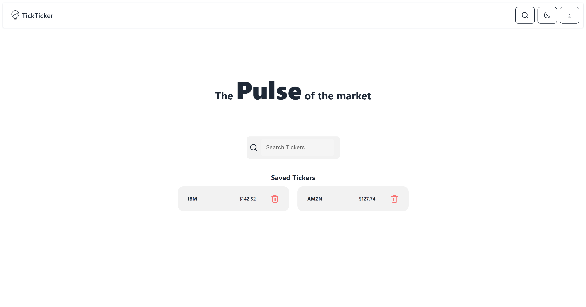
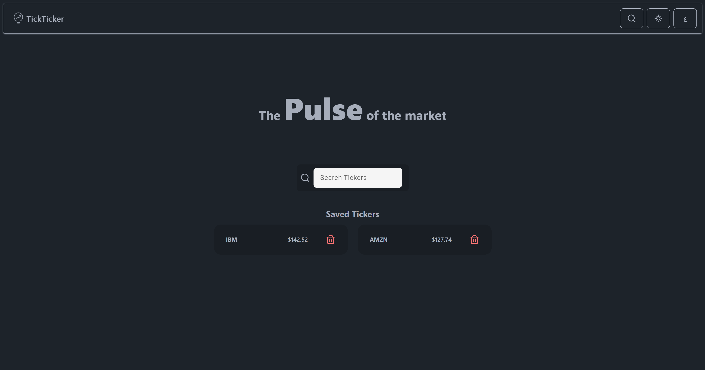
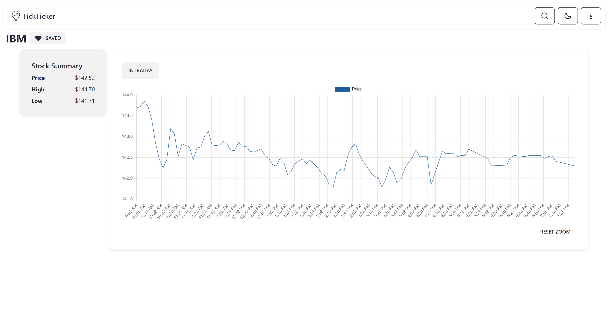

# TicTicker

TickTicker is an Angular application that displays current and previous days' ticker prices. It uses an API to fetch data and includes charts to relate the personal project to the project management tools for the main platform. The project was extended to support multiple languages (Arabic and English) and dark and light themes.

## Demo
Find a live demo for the application [here](https://abdullahabuhelal.github.io/TickTicker/).

## Screenshots 




## Installation Guide

### Requirements
- Angular Cli v16
- API Key form [Alphavantage](https://www.alphavantage.co/support/#api-key)

### Installation
1. Clone the repository using this command 
  ```bash
  git clone https://github.com/AbdullahAbuhelal/TickTicker.git
  ```
2. Run this command to install missing packages
```bash
npm install
```
3. Create `environment.ts` file in the directory `TickTicker/src/app/environments/`.
4. In the `environment.ts` file, past the following code with replacing `YOURAPIKEY` with your API key.
```text
export const environment = {
  production: false,
  APIKEY: "YOURAPIKEY"
};
```
5. Run `ng serve` and navigate to `http://localhost:4200/`.
